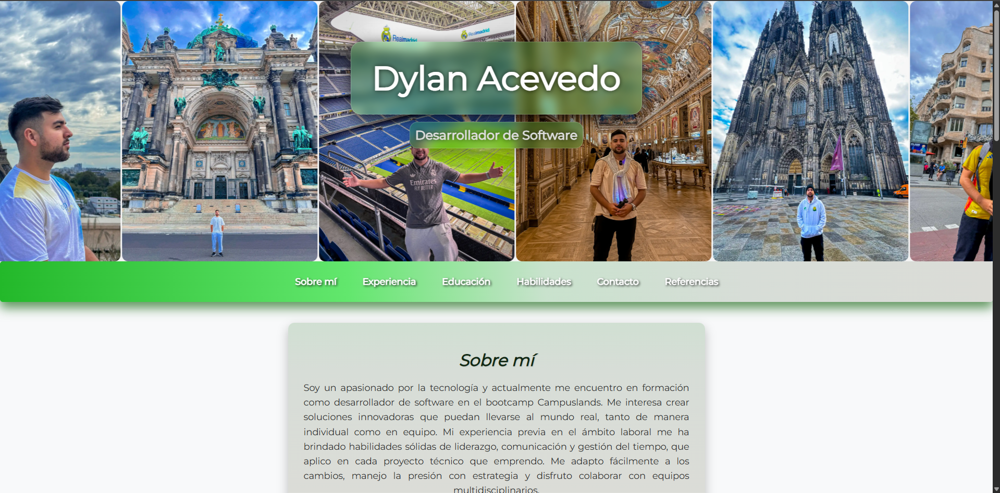

# Portafolio Web - Dylan

Este es mi portafolio personal como desarrollador en formación. Aquí presento mis proyectos, habilidades y una breve presentación sobre mí. Está desarrollado con HTML y CSS puros, con un enfoque en diseño responsive y limpio.

## 🌐 Demo en línea

Puedes ver el portafolio publicado en GitHub Pages aquí:  
👉 [https://deamacevedo.github.io/Portafolio-Dylan/](https://deamacevedo.github.io/Portafolio-Dylan/)  


## 🚀 Tecnologías usadas

- HTML5
- CSS3
- Fuentes personalizadas con `@font-face` (Montserrat)
- Media queries para diseño responsive
- Flexbox para distribución de elementos
- Efectos con `text-shadow`, `transition`, etc.

## 🎨 Características

- Diseño completamente adaptable a móviles
- Menú de navegación estilizado
- Uso de fuentes descargadas localmente
- Interfaz clara y profesional

## 📁 Estructura del proyecto

```
/fonts             → Archivos TTF de la fuente Montserrat
/icons             → Archivos de iconos
/imgs              → Archivos de imagen
/video             → Archivo de video
/index.html        → Página principal del portafolio
/README.md         → Este archivo
/styles.css        → Estilos principales
```

## 📸 Captura de pantalla



## 🛠 Cómo usarlo

1. Clona este repositorio:
   ```
   git clone https://github.com/Deamacevedo/Portafolio-Dylan
   ```

2. Abre el archivo `index.html` en tu navegador.

## 📬 Contacto

Si deseas contactarme o saber más de mi trabajo:

- ✉️ Email: dylanacevedoxd@gmail.com
- 📂 Proyectos: disponibles dentro del portafolio

---

### 📌 Nota final

Este proyecto es parte de mi formación como desarrollador web y seguirá evolucionando a medida que adquiera nuevas habilidades.